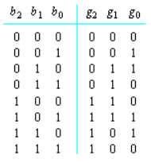
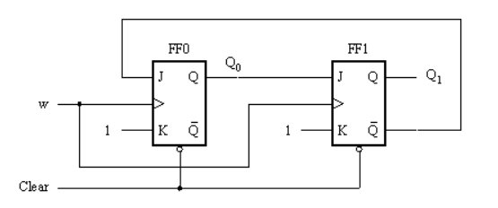
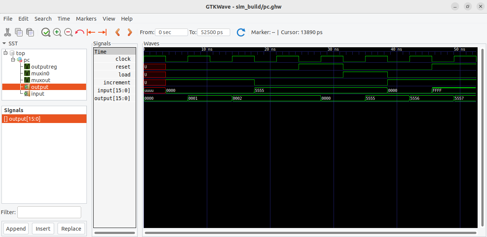

# Av2 - 1° Semestre de 2024

Avaliação 2 - Elementos de Sistemas

| Pontos HW | Pontos SW |
|:---------:|:---------:|
| 40        | 10        |

- Avaliação individual.
- 120 min total.
- Ficar no blackboard durante a prova.
- Fazer commit ao final de cada questão.
- Lembre de dar **push** ao final.

## 1. Lógica combinacional - codificador

| Pontos HW | Pontos SW |
|:---------:|:---------:|
| 10        | 0         |

A Figura a seguir 

mostra a tabela de conversão entre três bits em binário e seu correspondente código Gray.

Escreva o código em VHDL que realize essa função.

### Implementação

Implemente a saída `g` (de três bits) no arquivo `src/gray.vhd`.

**Lembre de testar com `pytest -k gray`**

#### Rubrica para avaliação:

| Pontos HW | Descritivo                                |
|-----------|-------------------------------------------|
| 2         | Implementação de g2 |
| 4         | Implementação de g1 |
| 4         | Implementação de g0 |

## 2. Lógica combinacional - VHDL

| Pontos HW | Pontos SW |
|:---------:|:---------:|
| 10        | 0         |

Considere o código vhdl a seguir:

``
library IEEE; 
use IEEE.STD_LOGIC_1164.ALL;

entity blocoX is
	port ( 
			a:   in  STD_LOGIC_VECTOR(3 downto 0);
            p:  in STD_LOGIC;
			q:  out STD_LOGIC);
end entity;

architecture rtl of blocoX is
            SIGNAL y: STD_LOGIC;
begin
            y <= a(3) xor a(2) xor a(1) xor x(0);
            q <= ( (not y) and p) or (y and (not p) );
end;
``

### Questões:

1. Explique o que o circuito faz no  arquivo `Q2.txt`.
2. Desenhe o circuito lógico correspondente e anexe o arquivo no repositório.

#### Rubrica para avaliação:

| Pontos HW | Descritivo                                 |
|-----------|--------------------------------------------|
| 5         | Para cada item |

## 3. Subtrator

| Pontos HW | Pontos SW |
|:---------:|:---------:|
| 10        | 0         |

Queremos agora implementar um full subtractor.

Um full subtractor possui três bits de entrada e dois bits de saída. Ele deve realizar a operação A-B-C, sendo que `resultado` apresenta o resultado da subtração e `vemum` a necessidade de trazer um bit da casa seguinte.

### Implementação/questão:

1. Implemente um full subtractor `src\fullsub.vhd`

**Lembre de testar com `pytest -k fullsub`**

#### Rubrica para avaliação:

| Pontos HW | Descritivo                                 |
|-----------|--------------------------------------------|
| 10        | Implementação correta do subtrator         |
| ?         | Implementações incorretas serão analisadas caso a caso     |

## 4. Lógica sequencial

| Pontos HW | Pontos SW |
|:---------:|:---------:|
| 10        | 0         |

Considere o circuito da figura a seguir:

Considere que inicialmente o `Clear`está setado de forma que as saídas iniciais de ambos flip-flops sejam '0'. 
Em t=0, o `Clear`é desativado.
Determine as saídas Q0 e Q1 para os próximos 5 sinais de clock.

### Implementação/questão:

1. Indique os resultados para Q0 e Q1 no arquivo `src\circuito.txt`.

#### Rubrica para avaliação:

| Pontos HW | Descritivo                                 |
|-----------|--------------------------------------------|
| 10        | Determinação correta das saídas            |
| ?         | Análises incorretas serão vistas caso a caso     |

## 5. Identificação de erro

| Pontos HW    | Pontos SW      |
| :--------:   | :--:           |
|    0         |  10            |

A figura a seguir apresenta as curvas obtidas no GTKWave como resultado da simulação do módulo `pc.vhd`.
Entretanto, esse módulo apresenta um erro. Identifique, a partir das curvas fornecidas a condição em que está ocorrendo o erro.

{width=300}

### Implementação

Identifique o intervalo em que o erro ocorre e descreva qual seria o resultado esperado no arquivo `src/erro_pc.txt`.

#### Rubrica para avaliação:

| Pontos SW | Descritivo                                           |
|-----------|------------------------------------------------------|
| 10        | Intervalo identificado e erro descrito corretamente. |
| 5         | Apenas o intervalo foi identificado corretamente.    |

